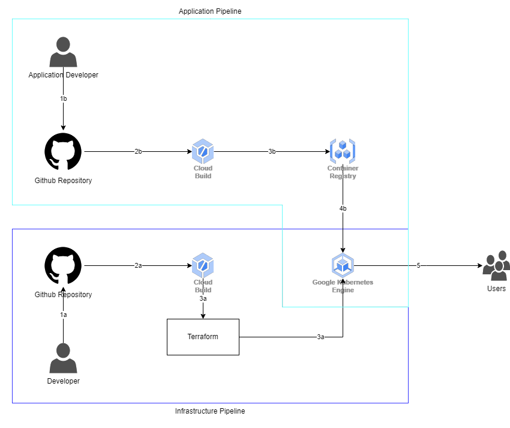

# ccx-ta
**URL:** http://35.241.98.136/

## Details
**Project Id:** ccx-technical-assesment

## Ingress Controller

### Helm Installation 

```
helm repo add ingress-nginx \
  https://kubernetes.github.io/ingress-nginx
```
```
helm repo update
```
```
helm install my-ing ingress-nginx/ingress-nginx \
  --namespace ingress \
  --version 4.0.17 \
  --values nginx.yaml \
  --create-namespace
```

### Nginx Controller Configuration
See `k8s/nginx.yml` file.

## CICD 


### Infrastructure Pipeline
- 1a. Developer push codes to the repository
- 2a. Push action will trigger Cloud Build
- 3a. `Cloud Build` will run the terraform commands and deploy or update the `Google Kubernetes Engine` and its infrastructure.

### Application Pipeline
- 1b. Developer push codes to the repository
- 2b. Push action will trigger Cloud Build
- 3b. Cloud Build will build the docker image from the `Dockerfile` then push the new built image to `Google Container Registry`.
- 4b. `Google Kubernetes Engine` pulls image from the `Google Container Registry` and creates/updates the deployments.